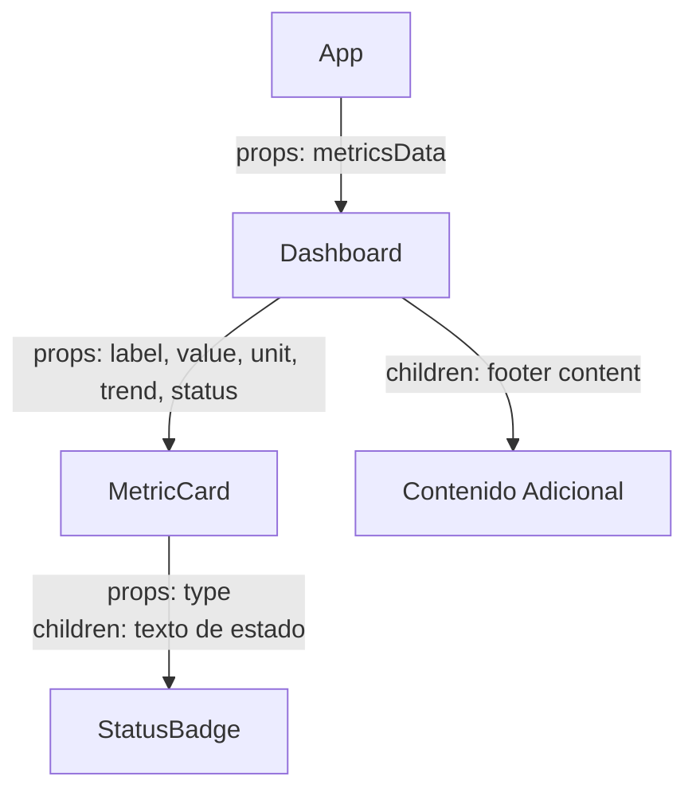

# Panel de Métricas Académicas - UNCP

Documentación técnica del proyecto desarrollado para la asignatura de Desarrollo de Aplicaciones Web (IS093A) - Unidad I: Desarrollo Web Frontend.

## Matriz de Cumplimiento de Objetivos de la Práctica

El presente proyecto ha sido diseñado estrictamente para cumplir con los cinco objetivos principales estipulados en la guía práctica semanal:

| Objetivo Requerido | Implementación en el Proyecto | Estado |
| :--- | :--- | :--- |
| **1. Arquitectura CSR** | Se implementó Vite con un `index.html` mínimo. La interfaz se construye dinámicamente mediante la hidratación del DOM vía JavaScript. | Cumplido |
| **2. Componentes Anidados** | Estructura jerárquica estricta: `<App>` → `<Dashboard>` → `<MetricCard>` → `<StatusBadge>`, utilizando *props* para datos y *children* para composición. | Cumplido |
| **3. Estilado Estratégico** | Uso de **CSS Modules** para evitar colisiones en tarjetas, **Inline Styles** calculados para métricas dinámicas, y **Variables CSS globales** para la paleta de colores. | Cumplido |
| **4. Validación de Tipos** | Implementación rigurosa de `PropTypes` y documentación `JSDoc` en todos los componentes para definir y validar las interfaces de las propiedades. | Cumplido |
| **5. Reporte CSR** | Inclusión de la sección de Validación CSR en este documento, preparada para adjuntar la evidencia de DevTools y la inspección del HTML inicial. | Cumplido |

---

## Arquitectura de Componentes

### Diagrama de Árbol y Flujo de Datos

El proyecto implementa una arquitectura basada en componentes con un flujo unidireccional de datos estricto (Top-Down).



**Análisis del Flujo:**
1. **`<App>`**: Componente orquestador que almacena el estado principal (`metricsData`). Delega la renderización a componentes hijos.
2. **`<Dashboard>`**: Contenedor de presentación. Recibe `metricsData` vía props e itera sobre el arreglo para instanciar múltiples `<MetricCard>`. Utiliza la prop `children` para renderizar contenido adicional en la base del panel, demostrando composición.
3. **`<MetricCard>`**: Componente presentacional. Recibe datos primitivos (strings y números) y calcula lógicamente el estilo dinámico (colores de tendencia) en tiempo de renderizado.
4. **`<StatusBadge>`**: Componente atómico. Recibe el tipo de estado vía props para aplicar clases CSS condicionales y el texto a mostrar mediante la prop `children`.

## Comparativa de Estrategias de Estilado

Para el desarrollo del panel, se ha implementado una estrategia híbrida de estilado, seleccionando la técnica más adecuada según el ámbito de aplicación:

| Estrategia | Componentes Aplicados | Justificación Técnica |
| :--- | :--- | :--- |
| **CSS Modules** | `Dashboard`, `MetricCard`, `StatusBadge` | Garantiza el encapsulamiento a nivel de componente. Genera hashes únicos en tiempo de compilación (ej. `_card_1a2b3`), previniendo colisiones de selectores en el entorno global. Ideal para la arquitectura CSR escalable. |
| **Estilos en Línea (Inline)** | `MetricCard` (Indicador visual) | Utilizado exclusivamente para propiedades cuyo valor es dinámico y depende de los datos en tiempo de ejecución (ej. color basado en la prop `trend`). Evita la generación de múltiples clases CSS estáticas. |
| **Variables CSS Globales** | `index.css` (Capa base) | Centraliza los *tokens* de diseño (colores primarios, tipografías, bordes) en la pseudo-clase `:root`. Asegura consistencia visual en toda la aplicación y facilita la implementación de temas. |

## Validación CSR (Client-Side Rendering)

### Diferencia entre HTML Estático y Renderizado en Cliente

En una arquitectura CSR convencional, el servidor entrega un documento HTML mínimo que carece de contenido semántico renderizado. La interfaz de usuario es construida enteramente en el navegador mediante JavaScript (proceso de hidratación).

El archivo `index.html` servido inicialmente contiene únicamente:
```html
<div id="root"></div>
<script type="module" src="/src/main.jsx"></script>
```

### Reporte de Hidratación y DevTools

**1. Inspección del Código Fuente Inicial (Ctrl+U)**
*(Inserte aquí la captura de pantalla del código fuente del navegador)*

**Explicación:** La captura demuestra que el documento HTML original no contiene los datos de las métricas. El SEO tradicional no indexaría este contenido sin un motor de JavaScript, verificando que el renderizado ocurre completamente en el cliente.

**2. Inspección con React DevTools**
*(Inserte aquí la captura de pantalla de React DevTools mostrando la jerarquía)*

**Explicación:** Una vez que el script principal se ejecuta, React inyecta los nodos en el `<div id="root">`. DevTools evidencia la estructura jerárquica `<App> -> <Dashboard> -> <MetricCard>` y confirma que las *props* (como los datos inmutables descendentes) están fluyendo correctamente hacia los componentes hijos, validando el flujo unidireccional.

## Configuración y Ejecución

El proyecto ha sido inicializado mediante Vite para optimizar el entorno de desarrollo.

```bash
# Instalación de dependencias
npm install

# Ejecución del servidor de desarrollo local
npm run dev

# Compilación de la aplicación para producción (Genera directorio /dist optimizado)
npm run build
```

##  Mejoras de Versión (UI/UX)
Para complementar los requerimientos técnicos de la asignatura, el proyecto ha sido dotado de un diseño premium utilizando técnicas avanzadas de **Glassmorphism**, iconografía vectorial dinámica y animaciones interactivas. 

Te invitamos a leer el archivo **[EXTRAS.md](./EXTRAS.md)** incluido en este repositorio para conocer el detalle técnico de cómo se lograron estos acabados profesionales sin romper las directrices de la guía de la práctica.

---

## Equipo de Desarrollo

* Barja Ortiz Erick Gerson
* Navarro Serva Lesly Brenda
* Toribio Anselmo David Angel
* Yauri Torres Benjamin Raul

**Universidad Nacional del Centro del Perú**
**Facultad de Ingeniería de Sistemas**
**Asignatura:** Desarrollo de Aplicaciones Web (IS093A)
**Semestre:** 2026 - I
