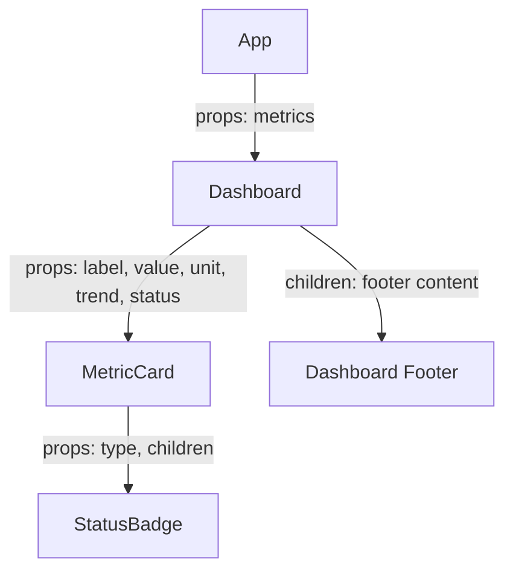

# Panel de Métricas Académicas - UNCP

Este proyecto es una aplicación web desarrollada con **React** y **Vite** para la asignatura de Desarrollo de Aplicaciones Web (IS093A). Implementa una arquitectura **CSR (Client-Side Rendering)** y un sistema de componentes anidados con flujo unidireccional de datos.

## 🚀 Arquitectura y Componentes

### Diagrama de Árbol de Componentes



### Flujo de Datos y Props
1.  **App**: Actúa como el orquestador principal, manteniendo el estado de los datos académicos.
2.  **Dashboard**: Recibe el arreglo de métricas y utiliza composición via `children` para inyectar contenido adicional en el pie del panel.
3.  **MetricCard**: Recibe datos primitivos y calcula estilos dinámicos (inline styles) para indicadores visuales según la tendencia.
4.  **StatusBadge**: Un componente atómico que utiliza `children` para renderizar el texto del estado con estilos condicionales.

## 🎨 Estrategias de Estilado

Se aplicó una estrategia híbrida para maximizar la mantenibilidad y el rendimiento:
-   **CSS Modules**: Utilizado en `Dashboard`, `MetricCard` y `StatusBadge` para garantizar el encapsulamiento de estilos y evitar colisiones de nombres globales mediante hashes únicos.
-   **Inline Styles**: Aplicados exclusivamente para valores dinámicos que dependen del estado o props (ej. colores de tendencia calculados en tiempo de ejecución).
-   **Variables CSS (Tokens)**: Definidas en `index.css` para mantener una consistencia visual (colores, fuentes, efectos de glassmorphism) en toda la aplicación.

## 🔍 Validación CSR (Client-Side Rendering)

### Análisis de Hidratación
En esta arquitectura, el archivo `index.html` servido por el servidor es mínimo:
```html
<div id="root"></div>
<script type="module" src="/src/main.jsx"></script>
```
La "hidratación" ocurre cuando el bundle de JavaScript se carga en el navegador, React toma el control del nodo `root` e inyecta dinámicamente todo el árbol de componentes.

### Capturas de Verificación (Simuladas)
> **Nota**: Para verificar manualmente, presione `Ctrl + U` en el navegador. Verá que el contenido de las métricas NO está presente en el código fuente inicial, confirmando que es 100% renderizado en el cliente.

| Estado | Descripción |
| :--- | :--- |
| **HTML Inicial** | Solo contiene el contenedor `#root` y la carga del script. |
| **Post-Hidratación** | El DOM completo está presente y React DevTools muestra el árbol de componentes. |

## 🛠️ Desarrollo y Despliegue

1. **Instalación**: `npm install`
2. **Desarrollo**: `npm run dev`
3. **Construcción**: `npm run build` (Genera carpeta `dist/` optimizada)

---
**Integrantes**: 
- [Tu Nombre/Grupo Aquí]
**Facultad de Ingeniería de Sistemas - UNCP**
